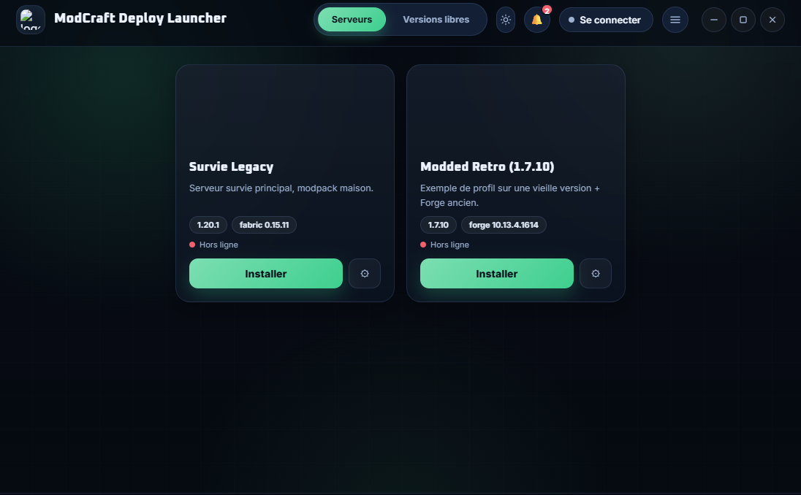
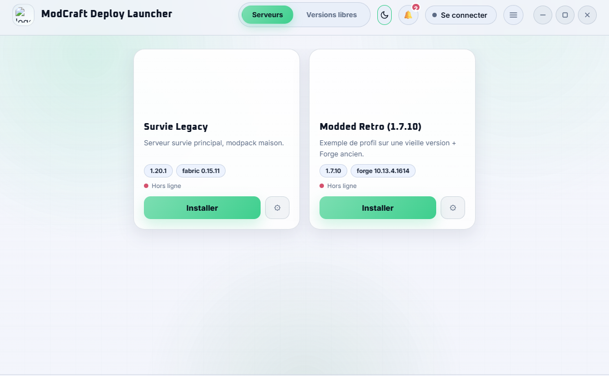
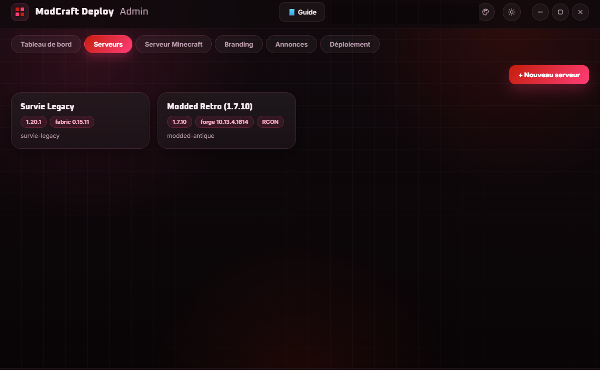
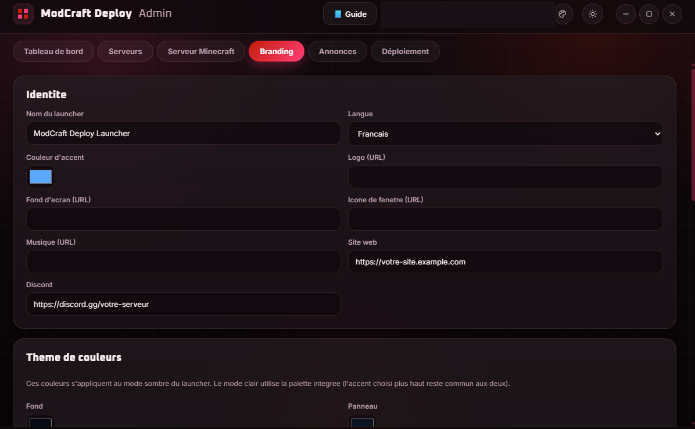

# ModCraft Deploy

Un launcher Minecraft que chaque communauté peut habiller à ses couleurs. Le nom, le logo, les serveurs et les modpacks viennent d'une petite API que vous hébergez vous-même : pour changer quelque chose, on modifie la config côté API et les joueurs le voient au prochain démarrage, sans recompiler.

<p float="left">
  
  
</p>
<p float="left">
  
  
</p>

Le projet contient trois applications :

```
api/        Backend Node/Express : échange de token, config (branding + serveurs), manifest d'intégrité des modpacks
launcher/   Application Electron pour les joueurs : connexion, synchronisation du modpack, installation du loader, lancement
admin/      Application Electron pour l'opérateur : édite la config, envoie les fichiers, fabrique un serveur Minecraft
```

Site : <https://modcraft-deploy.com> · Support : <support@modcraft-deploy.com> · Discord : <https://discord.gg/XmGvvKkr3X> · Soutien : <https://ko-fi.com/modcraft_deploy>

ModCraft Deploy est un projet indépendant, sans lien avec Mojang ni Microsoft. Voir [DISCLAIMER.md](DISCLAIMER.md).

## Licence

Le code est publié sous licence GNU GPL v3 ou ultérieure, voir [LICENSE](LICENSE). Vous pouvez l'utiliser et le modifier librement. Si vous distribuez une version modifiée, vous devez la publier sous la même licence, code source compris. Les polices Inter et Oxanium sont sous SIL OFL 1.1 (dossier [licenses](licenses)). Les dépendances sont listées dans [THIRD_PARTY_NOTICES.md](THIRD_PARTY_NOTICES.md).

Le nom et le logo « ModCraft Deploy » ne sont pas couverts par la licence. Si vous publiez une version modifiée, donnez-lui un autre nom.

Copyright (C) 2026 Yvan Braga.

## Comment ça marche

Le launcher ne contient aucune liste de serveurs. Au démarrage, il échange sa `launcherKey` contre un token (JWT) auprès de votre API, puis récupère le branding et les serveurs via `/api/config`. Sans token valide, l'API refuse tout : config, manifest et fichiers de modpack. Le launcher affiche alors un écran « connexion refusée ».

## Démarrage rapide (développement)

```bash
# 1. L'API
cd api
cp .env.example .env      # changez LAUNCHER_KEY et JWT_SECRET
npm install
npm start                 # http://localhost:8787

# 2. Le launcher, dans un autre terminal
cd launcher
cp launcher.config.example.json launcher.config.json
npm install
npm start
```

`launcher.config.json` doit pointer vers votre API et contenir la même `launcherKey` que `api/.env` :

```json
{ "apiBaseUrl": "http://localhost:8787", "launcherKey": "change-moi-en-production" }
```

Ce fichier est git-ignoré parce qu'il contient un secret. Sur une installation compilée, c'est l'installeur qui le crée : au premier lancement, il demande l'adresse de l'API et la `launcherKey`, puis les écrit dans `%APPDATA%\modcraft-deploy-launcher\launcher.config.json`. Ce fichier n'est jamais réécrit par une mise à jour et reste modifiable à la main. La variable d'environnement `LAUNCHER_CONFIG_PATH` permet de pointer vers un autre fichier et passe avant tout le reste.

## Ajouter un serveur

1. Ajoutez une entrée dans `api/data/servers.json` : `id`, `name`, `minecraftVersion`, `loader.type` (`vanilla`, `fabric`, `quilt`, `forge` ou `neoforge`), `loader.version`, `modpackId`, `iconUrl`, etc.
2. Déposez le contenu du modpack (`mods/`, `config/`, `resourcepacks/`...) dans `api/modpacks/<modpackId>/`.
3. Générez le manifest d'intégrité : `cd api && npm run manifest -- <modpackId>`.
4. Redémarrez l'API. Au prochain lancement, le launcher télécharge ce qui manque, supprime ce qui a été retiré et vérifie le sha256 de chaque fichier.

Refaites l'étape 3 à chaque mise à jour du modpack. Le launcher compare le manifest distant à l'état local et ne retélécharge que les fichiers modifiés.

L'application admin fait tout cela avec des formulaires, sans toucher au JSON (voir plus bas).

## Branding

Tout se règle dans `api/data/branding.json` : nom, logo, fond d'écran, couleur d'accent, palette complète, icône de fenêtre, langue, liens Discord et site, musique d'ambiance, et activation de chaque méthode de connexion (`microsoftAuth`, `elybyAuth`, `offlineAuth`). Le launcher applique ce branding au démarrage, donc un même build peut servir plusieurs marques.

- `theme` : couleurs `bg`, `panel`, `panelLight`, `text`, `textDim`, `danger`, `success`. Elles s'appliquent au mode sombre. Le joueur peut passer en mode clair, qui utilise une palette intégrée (seul `accentColor` est commun). Le joueur peut aussi choisir sa propre couleur d'accent dans les options.
- `windowIconUrl` : image PNG ou ICO utilisée comme icône de la fenêtre. L'icône du `.exe` lui-même est fixée à la compilation (`build.win.icon` dans `launcher/package.json`) et ne peut pas changer sans recompiler.
- `language` : `fr` ou `en`. Ajouter une autre langue demande de modifier `launcher/src/renderer/locales.js` et de recompiler.
- `musicUrl` : lien direct vers un fichier `.mp3` ou `.ogg` (pas une page web). Vous pouvez le déposer dans `api/public/`, servi sans token. Laissez vide pour désactiver. Le joueur règle le volume dans le launcher.
- `customInstances` : `{ "enabled": true, "bannerUrl": "" }` active l'onglet « Versions libres », où le joueur installe n'importe quelle version de Minecraft avec le loader de son choix, indépendamment de vos serveurs.
- `news.json` : tableau de `{ id, title, date, body }`, la plus récente en premier. Dès qu'il y a une entrée, un bouton « Annonces » apparaît dans le launcher. Le texte est toujours affiché en texte brut.
- `easterEgg` : sons ou gifs déclenchés en cliquant sur une zone cachée de la fenêtre. Vide par défaut.

## Comptes

- Hors ligne : le joueur choisit un pseudo, sans compte. L'UUID est calculé localement (`md5("OfflinePlayer:<pseudo>")`), comme le fait un serveur en `online-mode=false`. Le launcher officiel de Mojang ne propose pas ce mode, donc l'opérateur décide s'il l'active (`offlineAuth.enabled` dans `branding.json`). Il ne donne accès à aucun serveur qui vérifie les comptes. Le compte reste dans le gestionnaire de comptes et se reconnecte tout seul au démarrage.
- Microsoft : connexion par code d'appareil (Xbox Live, XSTS, Minecraft Services). Désactivée par défaut, car il faut d'abord créer une application Azure AD : « App registrations » dans le portail Azure, type « Personal Microsoft accounts only », activer « Allow public client flows », puis copier l'Application (client) ID dans `microsoftAuth.clientId` et passer `enabled` à `true`. Microsoft demande en plus de valider l'application avec [ce formulaire](https://aka.ms/mce-reviewappid). Sans cela, la connexion échoue avec une erreur 403 sur `api.minecraftservices.com`. Comptez jusqu'à 24 h.
- Ely.by : identifiant et mot de passe (plus le code 2FA si activé), envoyés directement à `authserver.ely.by`, jamais à votre API. Nous avions d'abord essayé OAuth2 avec PKCE, mais la page d'autorisation d'Ely.by ne transmet pas le paramètre `code_challenge` à sa propre API, ce qui bloque le flux pour un client public.

Le gestionnaire de comptes permet de changer de compte sans retaper de mot de passe. Pour Ely.by, le launcher réutilise le token Yggdrasil. Pour Microsoft, le cache MSAL est enregistré sur disque et chiffré. « Se déconnecter » garde le compte dans la liste, « Retirer » l'oublie.

## Loaders et Java

- Vanilla, Fabric et Quilt : le launcher fusionne lui-même le JSON de version (mécanisme `inheritsFrom`) à partir des API officielles.
- Forge, toutes versions, y compris 1.7.10 : le launcher télécharge l'installeur officiel et le passe à `minecraft-launcher-core`, qui lit `version.json` et `install_profile.json` dans le jar sans exécuter l'installeur.
- NeoForge : installeur officiel exécuté en mode silencieux (`--installClient`).

Le launcher choisit et installe lui-même le bon Java (`launcher/src/main/core/javaRuntime.js`). Il lit la version exigée par la version de Minecraft, cherche un Java correspondant dans le PATH et les dossiers d'installation habituels, et sinon télécharge un Eclipse Temurin dans son propre dossier de données, sans droits administrateur.

### Vieux modpacks

Les modpacks 1.7.10 et similaires plantent souvent pour des raisons sans rapport avec le serveur. Quelques garde-fous :

- Timeouts réseau courts pour la JVM (`launch.js`, `NETWORK_TIMEOUT_JVM_ARGS`), parce que beaucoup de vieux mods font des appels HTTP bloquants vers des domaines qui n'existent plus.
- Trois tentatives par fichier au téléchargement, pour les échecs réseau ponctuels.
- Diagnostic de crash lisible (`crashDiagnostics.js`) : après un code de sortie non nul, le launcher lit `logs/latest.log` et le dernier rapport de crash et affiche un résumé (exception, mod probable, RAM insuffisante, pilote GPU, mauvaise version de Java).
- À la génération du manifest, l'API signale un `.zip` oublié dans `mods/` ou un `.jar` corrompu. C'est purement informatif.
- Le popup de réglages suggère plus de RAM quand le dossier `mods/` est gros, sans jamais modifier une valeur déjà choisie.

Aucune de ces mesures n'empêche un mod mal écrit de planter. Pour un mod connu comme problématique au premier lancement, la solution fiable reste de fournir son fichier de config par défaut dans le modpack.

### OptiFine avec Forge ancien

Sur 1.7.10 et versions proches, OptiFine se charge par un second `--tweakClass` (`optifine.OptiFineForgeTweaker`) et non comme un mod normal. Le launcher le reproduit, mais optifine.net interdit le téléchargement automatique, donc il faut récupérer le jar une fois à la main :

1. Déposez `OptiFine_<version>.jar` dans `api/modpacks/<modpackId>/optifine/`, pas dans `mods/`, puis régénérez le manifest. S'il reste aussi dans `mods/`, le jeu plante au lancement (`OptiFine is installed. This is NOT supported.`), et le launcher refuse alors de démarrer avec un message clair.
2. Ajoutez à l'entrée du serveur : `"optifine": { "version": "1.7.10_HD_U_E7" }`, avec la version exacte du build. Ajoutez `"modsFile": "nom-exact.jar"` seulement si plusieurs fichiers se ressemblent.
3. Les joueurs récupèrent le jar par la synchronisation normale, sans rien faire.

## Paramètres par instance

Chaque carte serveur a un bouton d'options, stocké localement dans `settings.json` et jamais envoyé à l'API :

- Mémoire minimum et maximum de la JVM, plafonnée à la RAM détectée.
- Préférence GPU : automatique, économie d'énergie ou performances. Sous Windows, c'est écrit dans `HKCU\Software\Microsoft\DirectX\UserGpuPreferences` pour le `java.exe` utilisé. Sous Linux, ce sont les variables Prime / `DRI_PRIME`. Sous macOS, pas d'effet.
- Ouvrir le dossier de l'instance ou son dossier `logs/`.
- Réparer les fichiers : force une synchronisation complète du modpack. Les sauvegardes, `options.txt` et les captures ne sont jamais touchés.

Le menu Options propose aussi de vider le cache partagé (versions, bibliothèques, installeurs, runtimes Java), avec confirmation. Avant chaque téléchargement, le launcher vérifie l'espace disque libre avec 10 % de marge. Une installation libre peut être renommée, et la supprimer efface son dossier, mondes compris, après confirmation.

## Connexion automatique et badge d'authentification

Le bouton « Jouer » lance Minecraft déjà connecté au serveur, avec `--server` et `--port`, ce qui marche sur toutes les versions et tous les loaders.

Le champ `onlineMode` d'un serveur (case « Online-mode » dans l'admin) reflète le `server.properties` du serveur Minecraft. À `true`, seuls les comptes Microsoft peuvent rejoindre. À `false`, tous les comptes le peuvent. Si le champ est absent, aucune restriction. Une carte de serveur en ligne est grisée pour un compte gratuit ou Ely.by, avec la mention « Compte Microsoft requis pour ce serveur », et le verrouillage est recalculé à chaque changement de compte.

Chaque carte affiche aussi un point vert ou rouge et le nombre de joueurs connectés, rafraîchis toutes les 20 secondes avec le protocole Server List Ping standard.

## Sécurité des fichiers de modpack

- Liste blanche d'extensions (`fileAllowlist.js`, copié à l'identique dans `admin/`, `api/scripts/` et `launcher/`, à garder synchronisé). Seuls les formats utilisés par Minecraft passent : mods `.jar`, configs, packs de ressources et de shaders, textures, sons, structures. Les exécutables, scripts et DLL sont refusés à trois endroits : à l'import dans l'admin, à la génération du manifest et au téléchargement dans le launcher.
- Chemins : un manifest ne peut ni écrire ni supprimer en dehors du dossier de l'instance.
- Analyse Windows Defender (`avScan.js`) : après une synchronisation qui a réellement téléchargé des fichiers, le launcher lance `MpCmdRun.exe` sur le dossier de l'instance. Une menace détectée bloque le lancement. Si Defender est absent ou que l'analyse échoue pour une autre raison, le joueur peut quand même jouer. Windows uniquement.

Ce n'est pas un antivirus maison. Le launcher se contente de déclencher celui qui est déjà installé.

## Journalisation et debug

Chaque appel IPC est journalisé (`launcher/src/main/core/logger.js`, basé sur `electron-log`) : entrée, sortie, durée et exceptions. Mots de passe, jetons et `launcherKey` sont masqués avant l'écriture. Le fichier est `logs/main.log` dans le dossier de données du launcher, avec rotation à 5 Mo.

Cinq clics sur le logo en moins de trois secondes ouvrent les DevTools et le dossier des logs, pratique pour aider un joueur à distance.

## Application admin

`admin/` est réservée à l'opérateur et ne se distribue pas aux joueurs.

```bash
cd admin
npm install
npm start
```

- Tableau de bord : démarre et arrête l'API en local avec les logs en direct, sauvegarde et relance depuis une copie, et génère le `launcher.config.json` pour tester un launcher sur cette API.
- Serveurs : formulaire complet (version, loader, RCON, OptiFine, arguments Java), import d'un modpack et génération du manifest en un clic.
- Branding et Annonces : formulaires pour `branding.json` et `news.json`.
- Serveur Minecraft : fabrique un serveur prêt à l'emploi à partir d'un serveur configuré : jar ou installeur du loader, `mods/` et `config/` sans les mods client uniquement, `server.properties`, `eula.txt` (jamais accepté automatiquement), scripts de démarrage qui trouvent le bon Java. L'envoi peut se faire en SFTP, FTP ou FTPS vers n'importe quel hébergeur, sans jamais rien supprimer du monde.
- Déploiement : pousse `data/` et `modpacks/` vers votre serveur en SFTP, FTP ou FTPS, ou fait un commit et un push Git de `data/*.json` et des manifests uniquement. Les identifiants sont chiffrés avec le coffre du système.
- Apparence : couleur de l'outil au choix, mode clair ou sombre.

Une fois installée, l'application range ses données dans `<dossier utilisateur>/ModCraft Deploy Admin/`, hors du dossier d'installation et hors de « Documents ». Aucune installation de Node.js ni de npm n'est nécessaire, l'application embarque ce qu'il faut.

## Whitelist automatique

Le token protège votre config et vos modpacks, mais rien n'empêche un joueur de se connecter à votre serveur Minecraft avec un autre launcher s'il en connaît l'adresse. Pour réserver l'accès à votre launcher, l'API peut ajouter chaque joueur à la whitelist juste avant qu'il lance le jeu, avec RCON. C'est une fonction du serveur Minecraft lui-même, donc aucun plugin n'est nécessaire.

1. Le joueur clique sur « Jouer ».
2. Le launcher appelle `POST /api/servers/<id>/authorize-join` sur l'API avec son token.
3. L'API se connecte en RCON et exécute `whitelist remove` puis `whitelist add` avec le pseudo.

L'appel est best-effort : si l'API ou RCON est injoignable, le lancement n'est pas bloqué.

### Serveur en online-mode=false

Un serveur hors ligne calcule lui-même l'UUID `md5("OfflinePlayer:<pseudo>")`, casse comprise, pour tous les clients. Or `whitelist add` inscrit le vrai UUID Mojang du pseudo s'il existe, ou l'UUID hors ligne du pseudo en minuscules sinon. Dans les deux cas, l'entrée ne correspond pas à ce que le serveur calcule à la connexion, et le joueur reçoit « You are not white-listed on this server! ».

Pour ces serveurs, l'API écrit donc `whitelist.json` elle-même chez l'hébergeur (SFTP, FTP ou FTPS), avec les deux UUID hors ligne du pseudo (casse exacte et minuscules), puis envoie `whitelist reload` en RCON. Les entrées existantes du même pseudo sont remplacées, les autres joueurs ne sont pas touchés. Les écritures d'un même serveur passent dans une file, pour que deux joueurs simultanés ne s'écrasent pas.

Il n'y a rien à configurer en plus : l'admin recopie l'accès SFTP saisi pour envoyer le serveur (onglet « Serveur Minecraft ») dans le champ `whitelistAccess` du serveur, seulement si le serveur est hors ligne. Il faut ensuite déployer `servers.json` et lancer `npm install` dans l'API. Comme `rcon`, `whitelistAccess` n'est jamais envoyé au launcher.

| Serveur | Méthode |
|---|---|
| `online-mode=true` | RCON, avec une preuve de propriété du compte Microsoft (session Mojang) |
| `online-mode=false` avec accès SFTP ou FTP | écriture directe des deux UUID puis `whitelist reload` |
| `online-mode=false` sans accès | RCON seul, ne marche que pour un pseudo inexistant chez Mojang |

Sur un serveur hors ligne, mettez aussi `enforce-secure-profile=false` (1.19.3 et plus), sinon les comptes sans clé de chat signée sont refusés. Les serveurs générés par l'admin l'ont déjà.

### Côté serveur Minecraft

Dans le `server.properties` de chaque serveur à protéger :

```properties
white-list=true
enable-rcon=true
rcon.port=25575
rcon.password=un-mot-de-passe-long-et-différent-de-la-launcherKey
```

Attention, `white-list=true` s'applique immédiatement : ne l'activez que si vous êtes déjà dans `whitelist.json`, sinon vous risquez de vous enfermer dehors. RCON ne se recharge pas à chaud, il faut un redémarrage complet du serveur. Sur un hébergement conteneurisé (PufferPanel, Pterodactyl), le port RCON doit être ajouté comme allocation de port du serveur. Ouvrez-le uniquement à l'IP de votre API : quiconque connaît le mot de passe RCON peut exécuter n'importe quelle commande.

### Côté API

Ajoutez un bloc `rcon` à l'entrée du serveur dans `api/data/servers.json` :

```json
{
  "id": "survie",
  "rcon": { "host": "127.0.0.1", "port": 25575, "password": "un-mot-de-passe-long" }
}
```

`host` et `port` sont ceux que votre hébergeur expose. Ce bloc est retiré de la réponse de `/api/config` avant l'envoi. Sans bloc `rcon`, le serveur fonctionne normalement, sans whitelist automatique.

Pour tester la connexion depuis `api/` :

```bash
node -e "const { Rcon } = require('rcon-client'); Rcon.connect({ host: 'IP', port: 25575, password: 'MOT_DE_PASSE' }).then(async (r) => { console.log(await r.send('list')); await r.end(); }).catch(console.error);"
```

La console de l'API affiche pour chaque lancement l'UUID Mojang, l'UUID hors ligne et la réponse du serveur.

## Build et distribution

```bash
cd launcher
npm run dist
```

`electron-builder` produit l'installeur (configuration dans `launcher/package.json`). Il n'embarque aucune adresse d'API ni clé : l'installeur les demande à la première installation, ce qui permet de distribuer le même `.exe` à plusieurs communautés. Le chemin réellement utilisé est écrit dans `main.log` au démarrage.

Pour compiler vous-même, voir [docs/DEVELOPPEMENT.md](docs/DEVELOPPEMENT.md).

### Mises à jour automatiques

Le launcher et l'admin se mettent à jour avec `electron-updater` et un simple dossier web (fournisseur « generic »). Au démarrage, l'application lit `latest.yml`, télécharge l'installeur si la version publiée est plus récente, vérifie son empreinte sha512 et propose l'installation. Hors ligne ou sans rien de publié, l'étape est ignorée.

Les adresses sont écrites en dur, pour que seul celui qui compile décide qui peut envoyer une mise à jour :

| Application | Adresse | Définie dans |
|---|---|---|
| Launcher | `https://modcraft-deploy.com/updates/launcher/` | `launcher/src/main/core/updateConfig.js` et `build.publish` de `launcher/package.json` |
| Admin | `https://modcraft-deploy.com/updates/admin/` | `admin/src/main/core/updateConfig.js` et `build.publish` de `admin/package.json` |

Si vous reprenez le projet, remplacez ces adresses et la clé publique par les vôtres. Les dossiers `updates/` sont de simples sous-dossiers du site sur votre serveur web, ignorés par git.

Pour publier une version (remplacez `launcher` par `admin` pour l'autre application) :

1. Augmentez `version` dans `launcher/package.json`.
2. `cd launcher && npm run dist` produit l'installeur, son `.blockmap` et `latest.yml` dans `launcher/dist/`.
3. Signez depuis la racine du dépôt : `node scripts/sign-update.js launcher/dist`, qui produit `latest.yml.sig`.
4. Envoyez l'installeur, le `.blockmap`, `latest.yml.sig`, puis `latest.yml` en dernier. Laissez les anciens fichiers.

### Signature des mises à jour

`electron-updater` ne vérifie que l'empreinte écrite dans `latest.yml`. Quelqu'un qui prendrait le contrôle du serveur de mises à jour pourrait donc publier son propre installeur. Les deux applications exigent que `latest.yml` soit signé en Ed25519. La clé publique est dans le code (`UPDATE_PUBLIC_KEY` dans `updateConfig.js`), la clé privée reste sur votre PC. Une mise à jour sans signature valide est refusée, l'application continue de tourner et la raison est écrite dans `main.log`.

- Génération de la paire de clés, une seule fois : `node scripts/generate-update-key.js`. La clé privée est écrite dans `<dossier utilisateur>/.modcraft-signing/update-signing-private.pem`. Collez la clé publique affichée dans `UPDATE_PUBLIC_KEY` du launcher et de l'admin avant de compiler.
- Sauvegardez la clé privée ailleurs, ne la commitez jamais et ne la copiez pas sur un serveur. Si elle est perdue, les applications déjà installées ne reconnaîtront plus vos mises à jour.
- Pour un autre emplacement, utilisez la variable `MODCRAFT_SIGNING_KEY`.

Ce n'est pas une signature de code Windows, qui est payante : SmartScreen peut donc afficher un avertissement à l'installation.

### Discord Rich Presence

Désactivé par défaut. Créez une application sur <https://discord.com/developers/applications>, mettez son Application ID dans `discordRpc.clientId` de `branding.json` et passez `enabled` à `true`. Les joueurs verront « Joue sur <serveur> » pendant qu'ils jouent. Si Discord n'est pas lancé, le launcher fonctionne normalement.

## Sécurité

Voir [SECURITY.md](SECURITY.md) pour signaler une faille.

La `launcherKey` est compilée dans le launcher. Elle limite l'usage occasionnel de l'API mais n'est pas un secret inviolable, puisqu'un build peut toujours être inspecté. Si vous voulez une vraie authentification par utilisateur, ajoutez une étape de connexion avant l'échange de token. Le mot de passe RCON, lui, ne doit jamais quitter votre API. Le mot de passe Ely.by part directement du launcher vers `authserver.ely.by`.

## Contribuer

Voir [CONTRIBUTING.md](CONTRIBUTING.md).
